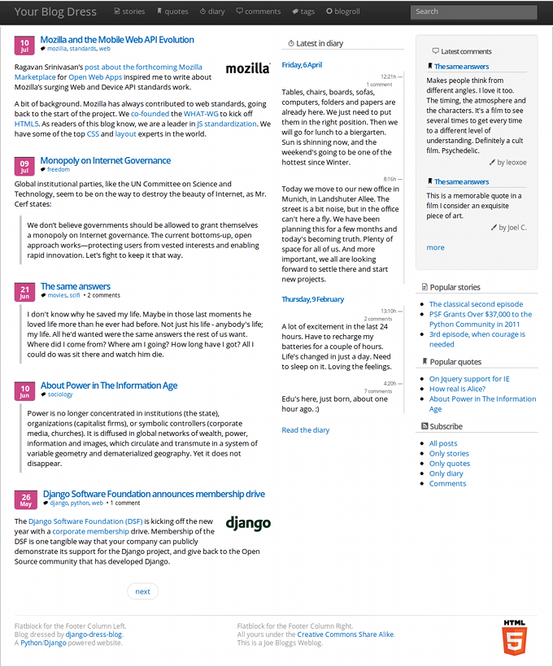

.. django-dress-blog documentation master file, created by
   sphinx-quickstart on Tue Jul 17 13:15:50 2012.
   You can adapt this file completely to your liking, but it should at least
   contain the root `toctree` directive.

Introducing Django-dress-blog
=============================

A pluggable application that provides blog capabilities to your Django project.

**Documentation work in progress!**

Features:

1. Three different type of posts: Stories, Quotes and Diary Entries.
2. Choose between either 3 or 4 columns layout format.
3. Default theme based on `twitter-bootstrap <http://twitter.github.com/bootstrap/>`_.
4. Create new themes without modifying existing code.
5. Posts may be in Draft/Public status, and published in the future.
6. Posts categorized with tags, with `django-tagging <http://code.google.com/p/django-tagging/>`_.
7. Independent paginated list of Stories, Quotes and Comments.
8. Comments managed with `django-comments-xtd <http://packages.python.org/django-comments-xtd/>`_.
9. Support for inline media with `django-inline-media <http://packages.python.org/django-inline-media/>`_.
10. Blogroll, Multiple Authors, Search capabilities with `django-haystack <http://packages.python.org/django-haystack/>`_, and more.

Run the demo project to see django-dress-blog in action.

Contents:

.. toctree::
   :maxdepth: 2

   quickstart
   installation
   configuration
   example
   tutorial
   theming
   settings
   templatetags

Indices and tables
==================

* :ref:`genindex`
* :ref:`modindex`
* :ref:`search`

